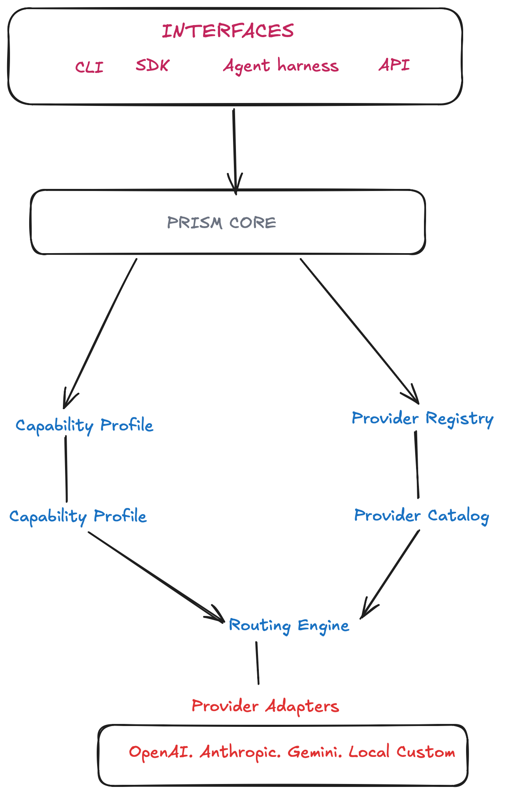

# Prism

> Explainable model routing for AI applications.

<!-- Replace with architecture diagram -->

  

---

## The Problem

Modern AI applications rarely use a single model.

Applications often combine OpenAI, Anthropic, Gemini, local models, or domain-specific providers. Choosing the right model becomes application logic scattered across the codebase:

- `if` statements based on provider capabilities.
- Cost and latency heuristics embedded in business logic.
- Provider-specific APIs leaking into application code.
- No visibility into *why* a particular model was selected.

As the number of providers grows, routing logic becomes increasingly difficult to maintain, reason about, and evolve.

---

## Our Approach

Prism separates **routing** from **execution**.

Instead of selecting providers directly, applications describe **what they need**.

Prism analyzes the request, builds a capability profile, evaluates available providers against configurable policies, and produces an explainable routing decision.

Execution is optional.

Prism can either return a routing decision for your application to execute, or dispatch the request through provider adapters.

This separation allows routing strategies to evolve independently of provider implementations.

---

## Principles

Prism is built around a few simple ideas.

### Explainable

Every routing decision should be inspectable.

Applications should understand **why** a provider was selected rather than treating routing as a black box.

### Provider Agnostic

Providers are interchangeable implementations.

Applications target capabilities, not vendor-specific APIs.

### Policy Driven

Cost, latency, privacy, availability, and custom constraints should be expressed as routing policies rather than hardcoded application logic.

### Architecture First

Routing is a system concern.

Interfaces, contracts, and decision boundaries are defined before provider implementations.

---

## Status

Prism is under active development.

The project is currently focused on building a robust routing engine before expanding into SDKs, provider integrations, and benchmarking.

---

## License

MIT
