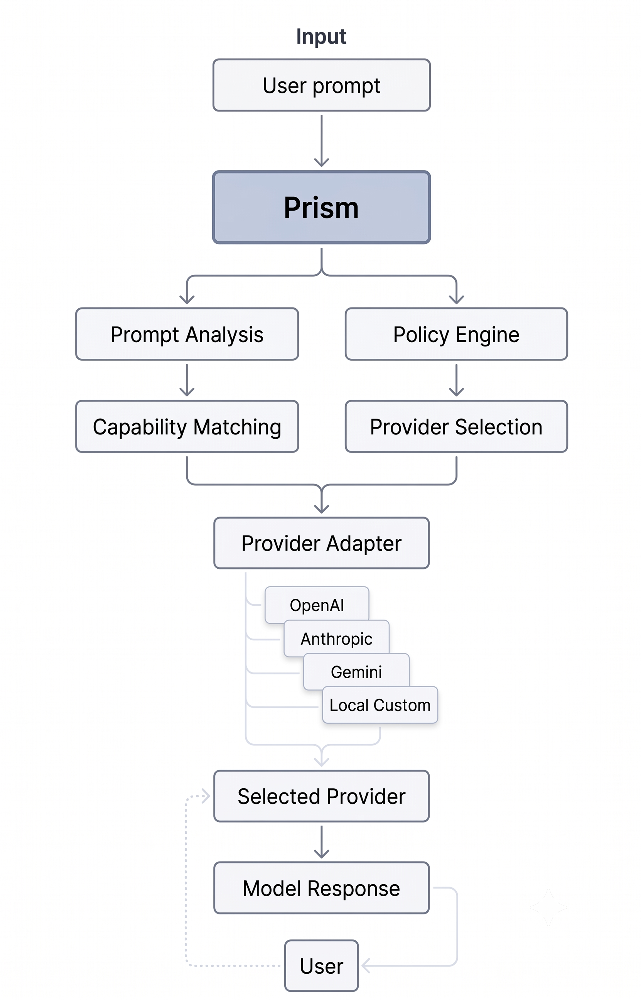

# Prism

> Explainable model routing for AI applications.

Prism separates routing from execution by making model selection explicit,
policy-driven, and explainable.

---

  

---

## The Problem

Modern AI applications rarely use a single model.

Applications today embed routing logic directly into business code.

- provider-specific conditionals
- capability checks
- latency heuristics
- cost thresholds
- fallbacks

As providers grow, routing becomes increasingly difficult to understand and maintain.

---

## Our Approach

Prism treats routing as its own system.

Instead of asking:

"Which provider should I call?"

Applications describe what they need.

Prism

- analyzes the request
- matches required capabilities
- evaluates routing policies
- selects the best execution target
- explains the decision

Execution is optional.

Prism can simply recommend a model or execute the request through provider adapters.

---

## Principles

### Explainable

Every routing decision should be inspectable.

### Capability Driven

Applications depend on capabilities, not vendors.

### Policy First

Cost, latency, privacy and governance are configurable.

### Provider Agnostic

Providers are plugins.

Applications never depend on vendor APIs.

---

## Architecture

The routing pipeline consists of six stages.

---

## Getting Started

Coming soon.

---

## Roadmap

- Core routing engine
- Provider registry
- Policy framework
- SDKs
- Benchmarks

---

## Contributing

Contributions are welcome.

See `CONTRIBUTING.md`.

---

## License

MIT
